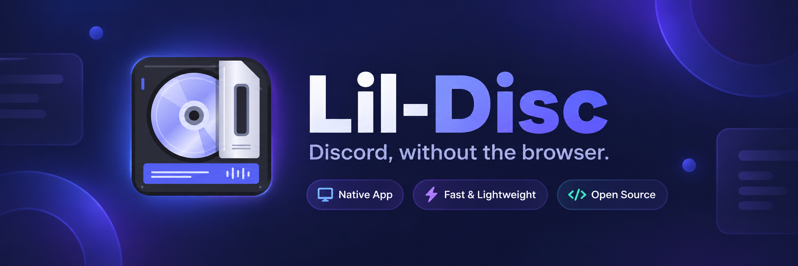

<p align="center">
  
</p>

<p align="center">
  A fast native GTK4 Discord client for Linux.<br>
  Tabs · responsive UI · GIFs, stickers & emoji · proper media handling · modular extras
</p>

Lil-Disc is a Discord client built like a normal Linux desktop application instead of a website wrapped in Chromium.

It uses **GTK4 + libadwaita**, starts quickly, has its own light and dark themes, works natively on Wayland and X11, and keeps optional features optional.

It began as a fork of [Dissent](https://github.com/diamondburned/dissent), whose native GTK rendering core it still uses, and has grown into a more full-featured daily-driver client with improved media, navigation, desktop integration and quality-of-life features.

> **Important:** Lil-Disc is an unofficial Discord client. Discord's Terms of Service prohibit third-party clients, and using one may put your account at risk. Use Lil-Disc only if you understand and accept that risk.

---

## Why Lil-Disc?

**Native Linux UI**
GTK4 and libadwaita instead of Electron. Its own light and dark themes follow your Discord appearance setting, and it behaves like the rest of your desktop.

**Small and responsive**
No bundled Chromium runtime. Pickers only draw what is on screen, embeds load lazily, and old cached images are cleaned up automatically.

**Built for an actual desktop**
Tabs that come back after a restart, resizable and collapsible sidebars, a keyboard-driven switcher and command palette, tray integration, notifications, custom CSS and GPU controls.

**Media that gets out of your way**
GIF autoplay, inline audio, better Twitter/X embeds, image saving, clipboard uploads, drag-and-drop, and optional mpv + yt-dlp playback.

**Useful extras, not mandatory extras**
Most additions live as individual modules and can be switched on or off under **Preferences → Mods**.

---

## See it in action

<!-- Screenshots to retake with the current theme. Suggested shots:
1. A conversation with the sidebar open
2. The sidebar dragged narrow, collapsed to avatars
3. The GIF, sticker or emoji picker open
4. Several tabs, with Ctrl+K open
A 15–20 second recording would be ideal too: launch, Ctrl+K to switch,
open a picker, play media, shrink the window until the sidebar collapses.

<p align="center">
  
</p>

<table>
  <tr>
    <td width="50%">
      
      <br><strong>Responsive layout</strong><br>
      Drag the sidebar narrow and it collapses down to avatars.
    </td>
    <td width="50%">
      
      <br><strong>GIFs, stickers & emoji</strong><br>
      Search and send without leaving the conversation.
    </td>
  </tr>
  <tr>
    <td width="50%">
      
      <br><strong>Tabs & quick navigation</strong><br>
      Keep conversations open and jump around with the keyboard.
    </td>
    <td width="50%">
      
      <br><strong>Better media handling</strong><br>
      Inline audio, improved embeds and optional mpv playback.
    </td>
  </tr>
</table>
-->

---

## Features

### Chat & sending

- Servers, channels, DMs, threads, friends and presence
- Forwarded messages shown with their content
- Drag-and-drop file uploads
- Paste images directly from the clipboard with **Ctrl+V**
- Reply preview above the message box
- GIF picker using Discord's own GIF search
- Sticker picker
- Server emoji picker with fuzzy search
- All three pickers work from the keyboard: type, arrow keys, Enter
- Friend nicknames shown throughout the UI
- Voice messages and audio files with inline playback and seeking
- Drafts kept per channel, across restarts
- Optional privacy for uploads: ordinary-looking filenames and stripped image metadata

### Images, GIFs & video

- GIF autoplay
- Full-size Twitter/X images
- Multi-image posts displayed as grids
- Support for fixupx, fxtwitter, vxtwitter and similar media-friendly links
- Giphy embeds displayed as actual GIFs
- Wider embed cards
- Image viewer sized to the actual image
- Right-click media to save it, copy its URL or open it in your browser
- Optional [mpv](https://mpv.io) playback
- Optional [yt-dlp](https://github.com/yt-dlp/yt-dlp) support for YouTube, Twitter/X, Twitch, TikTok and other sites

### Navigation & search

- Tabs for keeping multiple conversations open, restored when you start Lil-Disc again
- Returns to where you were reading in each channel
- Resizable server/channel sidebar, collapsing to avatars at narrow widths
- Presence indicators, with a distinct shape per status as well as a colour
- Collapsible **More** list for friends without an open DM
- **Ctrl+K** quick switcher, ranked by what you use and what is unread
  - `@` people, `#` channels, `!` servers, `>` commands
- **Ctrl+F** searches the open channel; press Enter to search it on Discord
- **Ctrl+Shift+F** searches everything loaded, or your local history if you turn it on
- Search filters: `from:` `in:` `has:image` `has:link` `before:` `after:` `on:`
- Search results, notifications and message links open at the exact message

### Desktop integration

- GTK4 + libadwaita
- Wayland-first, X11 supported
- Its own light and dark themes, or your system GTK theme if you prefer
- Minimize to system tray
- Configurable notifications
- Login remembered in your system keyring
- Custom CSS from `~/.config/lildisc/custom.css`
- Lazy-loaded embeds and automatic image-cache cleanup
- Integrated-GPU preference for hybrid/eGPU systems

### Optional mods

Extras are intentionally modular. Open **Preferences → Mods** and enable only the features you want. Current modules include:

```text
audio playback            local message history
auto idle                 message search
avatar cache refresh      notification controls
cache cleanup             oversized file upload
channel menus             presence indicators
compact sidebar           privacy (filenames, metadata)
custom CSS                reply preview
drag-and-drop upload      sticker picker
embed improvements        system tray
emoji picker              mpv video playback
friend list               keyboard shortcuts
GIF picker                lazy loading
hidden channels           media context menus
```

---

## Installation

### Prebuilt downloads

Every change to `master` is published on the [Releases page](https://github.com/vomitselfie/Lil-Disc/releases) with builds for Linux (x86_64 and aarch64) and Windows. A macOS build is included too, but it is experimental and untested.

### Arch / Manjaro

Build packages live in [`packaging/aur`](packaging/aur): `lildisc` for tagged releases, `lildisc-git` for the latest `master`.

```bash
git clone https://github.com/vomitselfie/Lil-Disc.git
cd Lil-Disc/packaging/aur/lildisc-git
makepkg -si
```

Install `gst-libav` as well; without it most videos and voice messages won't play.

### Flatpak

A manifest lives in [`packaging/flatpak`](packaging/flatpak). It has not been through a full build yet; see [`packaging/README.md`](packaging/README.md).

### From source

Install the dependencies (Arch / Manjaro shown):

```bash
sudo pacman -S go gtk4 libadwaita gtksourceview5 libspelling \
    gstreamer gst-plugins-base gst-plugins-good gst-libav
```

Clone and build:

```bash
git clone https://github.com/vomitselfie/Lil-Disc.git
cd Lil-Disc
go build -o lildisc .
./lildisc
```

The first build compiles the GTK Go bindings and can take ten minutes or more. Later builds are quick.

To add Lil-Disc to your application menu:

```bash
./install-local.sh
```

This installs the desktop entry and icon and links the binary into `~/.local/bin`, so rebuilding updates what the launcher runs. Remove it again with `./install-local.sh --uninstall`.

### Nix

The repository is also a Nix flake:

```bash
nix run github:vomitselfie/Lil-Disc
```

---

## Logging in

Lil-Disc logs in with a Discord token.

A Discord token is effectively equivalent to your account password.

**Never send it to anyone, paste it into a website, post it in an issue, or include it in logs or screenshots.**

To obtain your own token:

1. Open [discord.com/app](https://discord.com/app) and log in.
2. Press **F12** to open Developer Tools.
3. Open the **Network** tab.
4. Reload the page.
5. Filter requests for `api`.
6. Select one of your own requests.
7. Find the `Authorization` request header.
8. Copy its value into Lil-Disc's **Token** field.

Tick **Remember Account** to stay logged in. The token is kept in your system keyring (GNOME Keyring, KWallet or anything else implementing the Secret Service). Without a keyring you can store it in a file encrypted with a passphrase instead.

---

## Keyboard shortcuts

| Shortcut | Action |
|---|---|
| `Ctrl+K` | Quick switcher (`>` for commands) |
| `Ctrl+F` | Search this channel |
| `Ctrl+Shift+F` | Search everything |
| `Ctrl+/` | Show keyboard shortcuts |
| `Ctrl+Q` | Quit |
| `Up` | Edit your last message (in an empty message box) |
| `Esc` | Cancel a reply or edit |

---

## Oversized files

Files over Discord's upload limit can be uploaded to [0x0.st](https://0x0.st) instead, with the link inserted into your message.

That sends the file to a **public third-party host rather than Discord**, where anyone with the link can download it. So Lil-Disc asks each time, and you can switch the preference to **Always** or **Never**.

The Discord upload limit Lil-Disc assumes can be changed in preferences, because Discord's limits vary and change over time.

---

## Local message history

**Preferences → Mods → Keep Local Message History** saves messages Lil-Disc sees (up to 5,000 per channel) so **Ctrl+Shift+F** can search them later.

It is off by default because it stores message text unencrypted in `~/.local/state/lildisc/history`. Turning it off stops recording; **Ctrl+K**, then `> Clear Message History`, deletes what was saved.

---

## GPU selection

On hybrid-GPU or eGPU systems, GTK or video decoding may select a discrete GPU even when another GPU drives the display.

Enable **Preferences → Graphics → Prefer Integrated GPU** to keep GTK rendering and supported video decoding on the integrated GPU where possible. It takes effect on the next launch.

For manual control, Lil-Disc also reads `~/.config/lildisc/env` at startup. For example:

```sh
VK_LOADER_DEVICE_SELECT=1002:150e
GSK_RENDERER=vulkan
```

Environment variables already set before Lil-Disc launches take precedence.

To inspect GTK's Vulkan selection:

```bash
GDK_DEBUG=vulkan ./lildisc
```

---

## Troubleshooting

### Videos download but never play

The player hands the file to GStreamer, which needs decoders for the codecs inside. Most Discord videos and voice messages use H.264 and AAC:

```bash
sudo pacman -S gst-libav
```

If a video still fails, it now shows an error in place of the video, and the log has GStreamer's reason.

### Uploads are treated as spam

Discord scores how much a client looks like software rather than a person, hardest on attachments. Lil-Disc presents itself as the desktop client, and **Randomize Upload Filenames** produces names a real device would write, like `IMG_4821.jpg`.

The version numbers it reports go stale as Discord ships updates, and an old build number is itself conspicuous. Refresh them in `~/.config/lildisc/env` without rebuilding:

```sh
LILDISC_CLIENT_VERSION=0.0.140
LILDISC_CLIENT_BUILD_NUMBER=421337
LILDISC_NATIVE_BUILD_NUMBER=70201
LILDISC_CHROME_VERSION=152.0.7014.35
LILDISC_ELECTRON_VERSION=39.1.2
```

To read the current values, open the official client or web app with developer tools, pick any request to `discord.com/api`, and copy its user agent and `X-Super-Properties` value.

### The GIF picker says "Search failed"

The picker searches through Discord, which names its GIF provider in each request. If Discord changes provider, set the new name in `~/.config/lildisc/env`:

```sh
LILDISC_GIF_PROVIDER=klipy
```

### It looks like my GTK theme, not Lil-Disc

**Preferences → Appearance → Use LilDisc's theme** switches between Lil-Disc's own look and your system theme.

### Reporting a bug

Check the existing issues first. Useful details:

```text
Lil-Disc version (Preferences → About)
Linux distribution
Wayland or X11
relevant terminal output (journalctl --user -t lildisc)
steps to reproduce
```

**Never include your Discord token in a bug report or log.**

---

## For developers

Lil-Disc deliberately keeps optional additions small and isolated.

Most extra features live in `internal/mods/`. Each module owns its behavior and preference, with small integration points in the host application marked by comments such as:

```go
// mod: feature-name
```

```text
mods.go            entry points
apicache.go        shared on-disk API cache
audioplayer.go     inline audio / voice messages
autoidle.go        idle after inactivity
avatarcache.go     avatar cache refresh
cacheclean.go      automatic cache cleanup
channelmenu.go     channel context menu
compactsidebar.go  responsive avatar-only sidebar
customcss.go       custom CSS
dragdrop.go        file drag-and-drop
embedmenu.go       media save/copy/open menu
embeds.go          GIF/video/embed improvements
emojipicker.go     server emoji picker
friendlist.go      DM friend list
gifpicker.go       GIF search
hiddenchannels.go  locked channels
history.go         local message history
keybinds.go        keyboard shortcuts
lazyload.go        lazy-loaded embeds
mediahost.go       oversized-file upload
notifications.go   notification behavior
presence.go        presence indicators
privacy.go         upload filenames and metadata
replypreview.go    reply preview
search.go          message search
stickerpicker.go   sticker picker
tray.go            system tray
videoplayer.go     mpv integration
```

Other pieces worth knowing:

```text
internal/gtkcord/palette.go       the light and dark themes
internal/components/pickergrid/   the virtualized picker grid
internal/history/                 local archive and search filters
internal/discordident/            how Lil-Disc presents itself to Discord
chatkit/                          diamondburned's chatkit, vendored with fixes
packaging/                        AUR and Flatpak
```

Lil-Disc communicates with Discord using [arikawa](https://github.com/diamondburned/arikawa) and renders its interface with [gotk4](https://github.com/diamondburned/gotk4) and libadwaita.

The application icon source is `internal/icons/io.github.vomitselfie.lildisc.Source.svg`. After editing it:

```bash
go generate ./internal/icons/
```

---

## Philosophy

Lil-Disc is not trying to reproduce every feature Discord has ever shipped.

It is trying to be the Discord client you can leave open all day:

- quick to launch
- lightweight
- native
- keyboard-friendly
- good at chat and media
- configurable without becoming complicated

Less stuff between you and your messages.

---

## Credits

Lil-Disc began as a fork of [Dissent](https://github.com/diamondburned/dissent) by diamondburned and still shares its native GTK rendering core.

- [Dissent](https://github.com/diamondburned/dissent): the native GTK4 Discord client Lil-Disc descends from
- [Vesktop](https://github.com/Vencord/Vesktop): inspiration for the modular feature system
- [arikawa](https://github.com/diamondburned/arikawa)
- [gotk4](https://github.com/diamondburned/gotk4)
- [gotkit](https://github.com/diamondburned/gotkit)
- [chatkit](https://github.com/diamondburned/chatkit)
- [ningen](https://github.com/diamondburned/ningen)

The core libraries above are by diamondburned.

---

## License

GPL-3.0.
